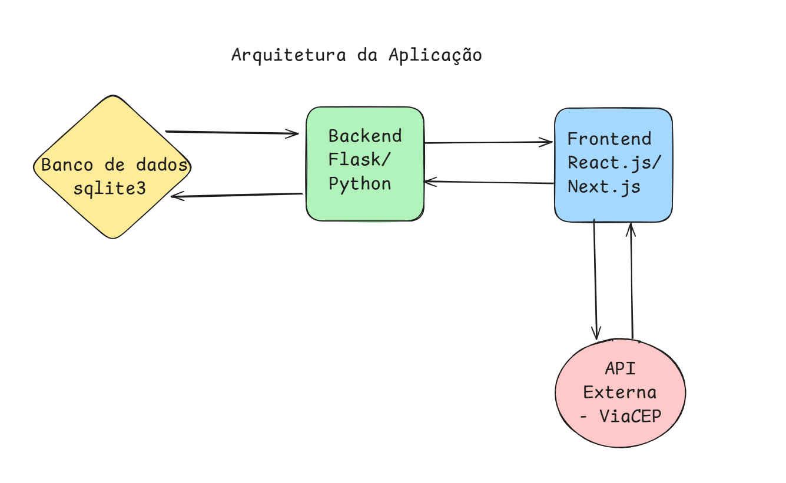

# Minha API

Este pequeno projeto faz parte do material diático da Disciplina **Arquitetura de Software** e foi feito por Vagner Morais.

O objetivo aqui é desenvolver uma ferramenta que supra as necessidades de pessoas que jogam futebol amador e precisam gerenciar datas de jogos, participantes, pagamentos, etc.

---

Este projeto foi desenvolvido com as seguintes tecnologias:

- **Backend:** Flask
- **Frontend:** NextJS, React
- **Banco de Dados:** sqlite3
- **Infraestrutura:** Docker, Docker Compose


## Arquitetura da Aplicação

A arquitetura desta aplicação foi definida e organizada como na imagem abaixo:



---

## Como executar sem o Docker

### Backend


Será necessário ter todas as libs python listadas no `requirements.txt` instaladas.
Após clonar o repositório, é necessário ir ao diretório raiz, pelo terminal, para poder executar os comandos descritos abaixo.

> É fortemente indicado o uso de ambientes virtuais do tipo [virtualenv](https://virtualenv.pypa.io/en/latest/installation.html).

```
(env)$ pip install -r requirements.txt
```

Este comando instala as dependências/bibliotecas, descritas no arquivo `requirements.txt`.

Para executar a API  basta executar:

```
(env)$ flask run --host 0.0.0.0 --port 5000
```

Em modo de desenvolvimento é recomendado executar utilizando o parâmetro reload, que reiniciará o servidor
automaticamente após uma mudança no código fonte. 

```
(env)$ flask run --host 0.0.0.0 --port 5000 --reload
```

Abra a API em  [http://localhost:5000/#/](http://localhost:5000/#/) no navegador para verificar o status da API em execução.


### Frontend
cd golzinho_frontend
npm install
npm run dev

O Frontend rodará  em http://localhost:3000.


## Como executar com o Docker
- Baixe o Docker
- Clone o repositório do backend em https://github.com/vaguinho707/backend_arquiteturadesoftware
- Clone o repositório do backend em https://github.com/vaguinho707/backend_arquiteturadesoftware

### Backend
- docker compose up --build
O Backend rodará  em http://localhost:5000/#/.


### Frontend
- cd golzinho_api
- Baixe o Docker
- docker compose up --build
O Frontend rodará  em http://localhost:3000.
